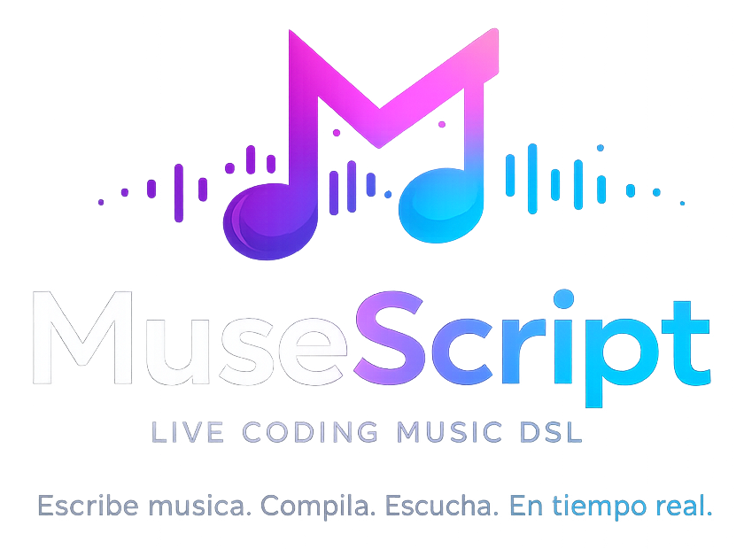
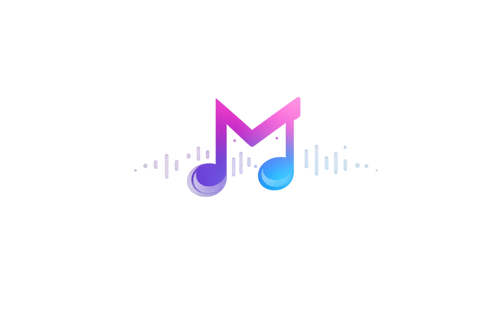

<div align="center">
  
</div>

# MuseScript

MuseScript es un playground de live coding musical para navegador. Permite
escribir música con un DSL legible, ver sus errores y representación compilada,
y reproducirla en vivo usando Scribbletune y Tone.js.

MuseScript utiliza [Scribbletune](https://scribbletune.com/documentation) para
la generación de escalas, progresiones, arpegios y patterns musicales. Tone.js
se encarga de programar y reproducir el audio en el navegador.

```txt
tempo 126

channel bass {
  instrument FMSynth
  clip pulse {
    notes D2 D2 C2 D2 Bb1 C2
    pattern x-x-x---x-x-xx--
    subdiv 16n
  }
  play pulse
}
```

## Características

- Editor con resaltado sintáctico, autocompletado contextual y compilación automática.
- Notas, silencios, acordes, loops y secciones nombradas.
- Clips compatibles con patterns de Scribbletune.
- Escalas, progresiones y arpegios.
- Canciones con múltiples canales e instrumentos.
- Volumen independiente por canal mediante decibelios.
- Reproducción, stop, restart, auto-play y tempo en vivo.
- Diagnósticos con línea, columna y código de error.
- Vista del AST y de la canción compilada.
- Exportación MIDI para secuencias de eventos explícitos.
- 25 ejemplos ordenados desde cero, pasando por melodías de dominio público,
  hasta canciones expertas.
- Funcionamiento completamente frontend, sin backend.

## Requisitos

- Node.js 20 o superior.
- pnpm 10.33.0 o compatible.
- Navegador moderno con Web Audio API.

## Inicio rápido

```bash
pnpm install
pnpm dev
```

Abre la URL indicada por Vite. Dentro de la aplicación:

1. Selecciona `01 · Tu primera nota`.
2. Pulsa **Activar audio**.
3. Modifica el código.
4. Activa **Auto-play** para escuchar cada compilación válida.

El navegador exige una interacción del usuario antes de permitir audio. El
parser, compilador y diagnósticos funcionan aunque el audio todavía no esté
activado.

## Scripts

| Comando | Descripción |
| --- | --- |
| `pnpm dev` | Inicia Vite en modo desarrollo |
| `pnpm build` | Valida TypeScript y genera `dist/` |
| `pnpm preview` | Sirve localmente el build de producción |
| `pnpm test` | Ejecuta todos los tests una vez |
| `pnpm test:watch` | Ejecuta Vitest en modo watch |

## Ejemplo completo

```txt
tempo 120

channel melody {
  instrument FMSynth
  clip lead {
    notes scale C4 major
    pattern x-x-[xx]
    subdiv 8n
  }
  play lead
}

channel harmony {
  instrument PolySynth
  clip chords {
    notes progression C4 major I V vi IV
    pattern x---x---x---x---
    subdiv 4n
  }
  play chords
}
```

## Documentación

- [Documentación oficial de Scribbletune](https://scribbletune.com/documentation)
- [Índice de documentación](docs/README.md)
- [Inicio rápido](docs/getting-started.md)
- [Tutorial de cero a experto](docs/tutorial.md)
- [Referencia completa del DSL](docs/dsl-reference.md)
- [Interfaz, reproducción y MIDI](docs/playback-and-midi.md)
- [Arquitectura y contribución](docs/architecture.md)
- [Guía de contribución](docs/contributing.md)
- [Build y despliegue](docs/deployment.md)
- [Resolución de problemas](docs/troubleshooting.md)
- [Gramática formal](docs/grammar.md)

## Arquitectura resumida

```txt
Source DSL
  -> Tokenizer
  -> Parser + AST
  -> Semantic compiler
  -> CompiledSong
  -> Scribbletune theory adapter
  -> Tone.js scheduler
  -> Audio
```

La lógica del DSL no depende de React ni de los motores musicales. La
reproducción está aislada mediante el puerto `MusicEngine`.

## Identidad visual

<p align="center">
  
</p>

Los recursos visuales originales se encuentran en:

- [`src/assets/logo.png`](src/assets/logo.png): logo principal.
- [`src/assets/slogan.png`](src/assets/slogan.png): composición con nombre,
  descripción y slogan.

## Estado y limitaciones

- La aplicación es una base funcional y extensible, no un DAW completo.
- Los corchetes de patterns Scribbletune se validan, pero actualmente se
  reproducen como pasos aplanados.
- La exportación MIDI cubre eventos explícitos; los clips teóricos o nativos aún
  no se expanden al archivo MIDI.
- Scribbletune se usa para teoría musical y Tone.js para scheduling moderno.

Consulta [troubleshooting](docs/troubleshooting.md) para detalles.

## Librerías principales

- [Scribbletune](https://scribbletune.com/documentation): generación musical,
  teoría, acordes, escalas, progresiones, arpegios y patterns.
- [Tone.js](https://tonejs.github.io/): scheduling, instrumentos y reproducción
  mediante Web Audio API.
